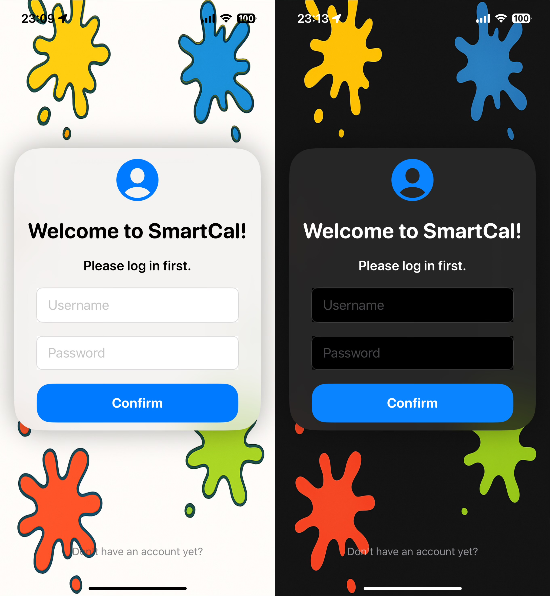
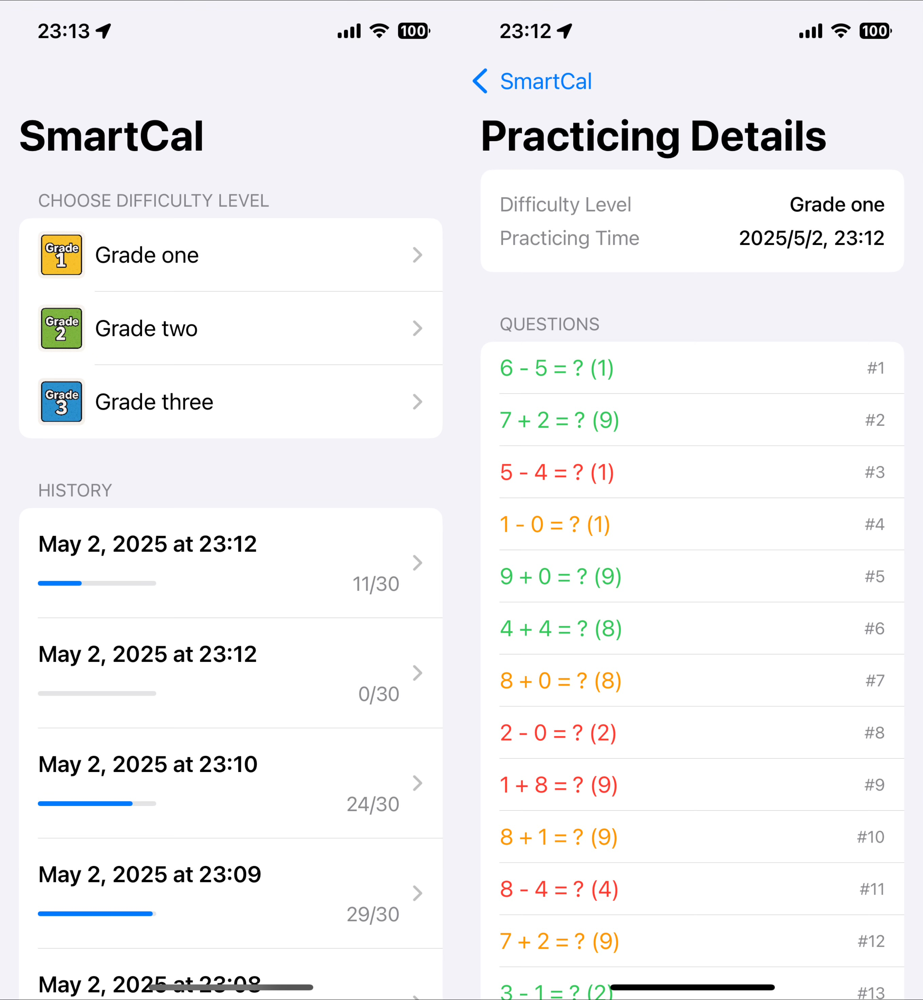
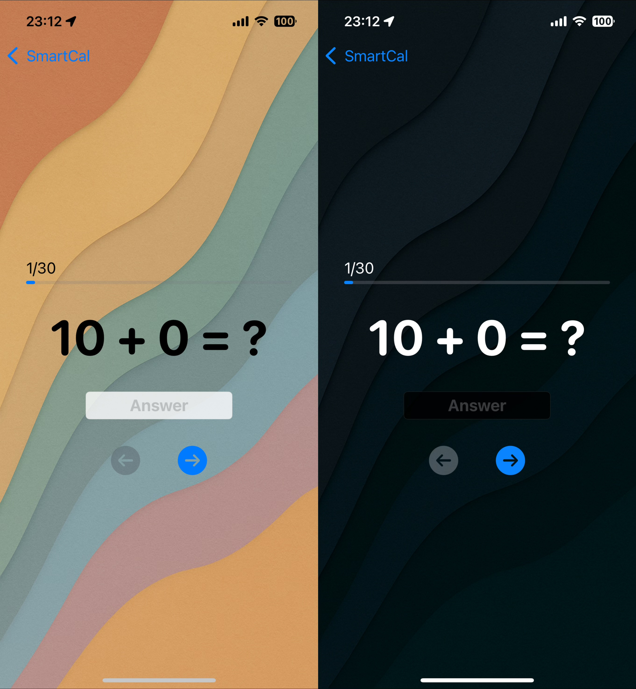

# SmartCal – A Mental Arithmetic App for Kids

> 🌐 [Read this in Chinese 中文版](./README.zh.md)

**SmartCal** is a SwiftUI-based iOS application designed to help children practice mental arithmetic. It features a simple login system, persistent user data using Core Data, and a user-friendly interface suitable for young users.

## ✨ Features

**User Account System**
- Register and log in with a local account (username + password)
- Each user has an isolated data environment
- Supports multiple accounts on the same device

**Local Data Persistence (Core Data)**
- All data is saved locally using Core Data
- Data persists across app restarts without needing a server
- Each user's practice results and progress are stored separately
- Each account can view all of their past practice records

**Beautiful and Accessible UI**
- Blurred glass-style login interface
- Beautiful background images
- Dark mode support
- Background music
- Animated SF Symbols

## 📸 Screenshots

| Login View | Main View | Game View |
|--------------|-------------|-------------|
|  |  |  |

## 🛠 Technologies Used

- **SwiftUI** – modern, declarative UI framework
- **Core Data** – local data storage and user management
- **Xcode** – iOS app development environment

## 🚀 Getting Started

To build and run the project:

1. Clone this repository.
2. Open `SmartCal.xcodeproj` in Xcode.
3. Run the app on a simulator or real device.

⚠️ Requires Xcode 14+ and iOS 16+ for `NavigationStack` and modern SwiftUI APIs.

## 📂 Project Structure

- `ContentView.swift` – login screen and navigation logic
- `RegisterView.swift` – user registration view
- `MainView.swift` – post-login main screen showing user-specific content
- `GameView.swift` - the interface where users answer questions
- `Persistence.swift` – Core Data stack setup

## 🙌 Credits

Developed by Neo_FANG  
The majority of the app was developed in 48H   
For learning and educational purposes

## 📄 License

This project is licensed under the MIT License
