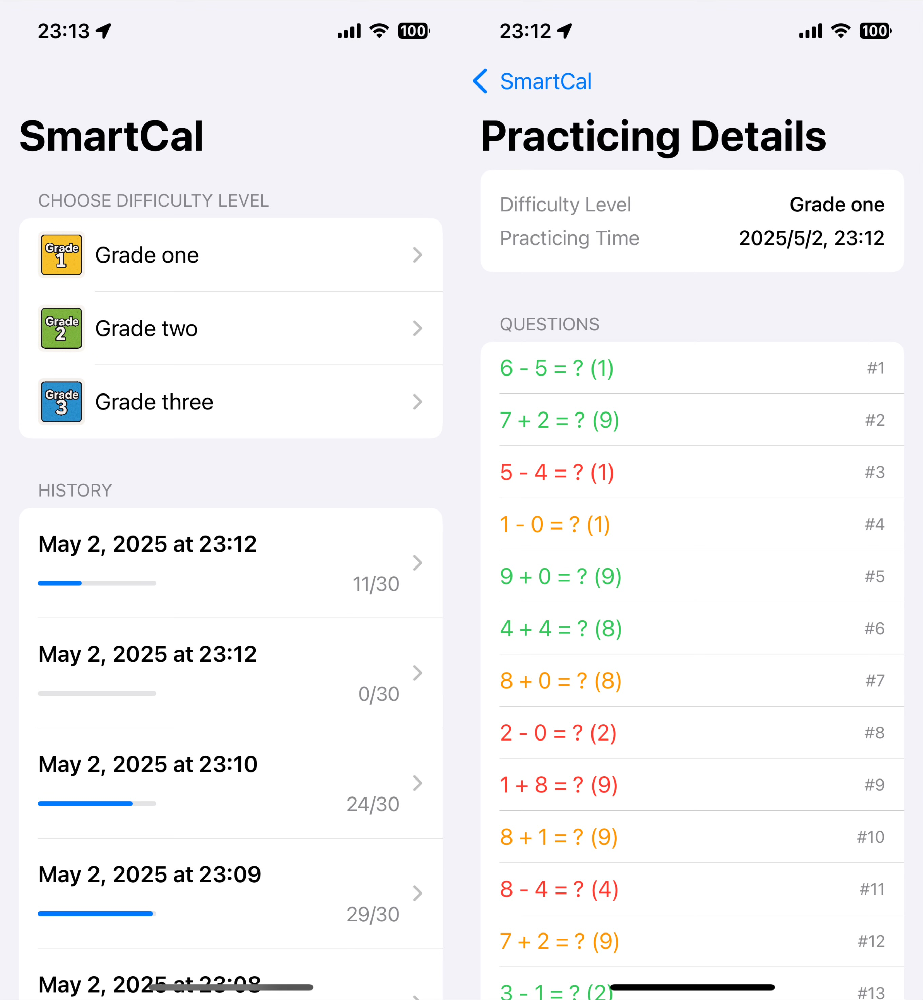
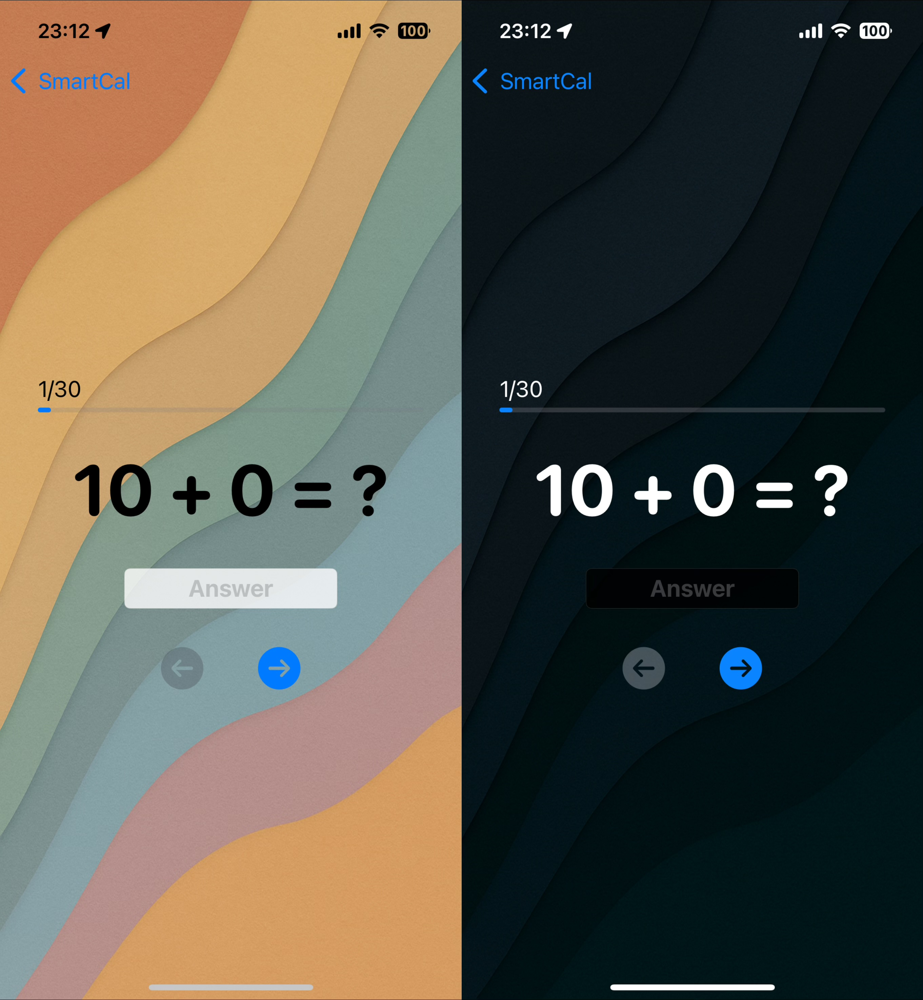

# SmartCal – 儿童口算辅助 App

> 🌐 [View English Version / 英文版](./README.md)

**SmartCal** 是一个基于 SwiftUI 的 iOS 应用，旨在帮助儿童进行心算练习。它包含简单的登录系统、基于 Core Data 的本地数据持久化功能，以及适合儿童使用的友好界面。

## ✨ 应用特点

**用户账户系统**
- 支持本地账户（用户名 + 密码）注册与登录
- 每位用户拥有独立的数据环境
- 同一设备支持多个账户共存

**本地数据持久化（Core Data）**
- 所有数据均使用 Core Data 本地保存
- 无需服务器支持，数据在重启后依然保留
- 每位用户的练习记录和进度分别保存
- 每个账户都可查看自己的历史练习记录

**美观且易用的界面**
- 毛玻璃风格的登录界面
- 精美背景图片
- 支持深色模式
- 背景音乐播放
- 动态 SF Symbols 图标动画效果

## 📸 应用截图

| 登录界面 | 主界面 | 游戏界面 |
|-----------|---------|----------|
|  |  |  |

## 🛠 使用技术

- **SwiftUI** – 现代声明式 UI 框架
- **Core Data** – 用于本地数据存储和用户管理
- **Xcode** – iOS 应用开发环境

## 🚀 快速开始

构建并运行该项目：

1. 克隆此仓库。
2. 使用 Xcode 打开 `SmartCal.xcodeproj`。
3. 在模拟器或真实设备上运行应用。

⚠️ 本项目使用 `NavigationStack` 和现代 SwiftUI API，需使用 Xcode 14+ 和 iOS 16+ 版本。

## 📂 项目结构

- `ContentView.swift` – 登录界面与导航逻辑
- `RegisterView.swift` – 用户注册界面
- `MainView.swift` – 登录后主界面，展示用户相关内容
- `GameView.swift` – 用户进行答题的界面
- `Persistence.swift` – Core Data 栈的设置文件

## 🙌 开发者信息

由 Neo_FANG 开发   
大部分功能于 48 小时内完成   
项目用于学习和教育目的

## 📄 许可证

本项目采用 MIT 开源许可证发布
